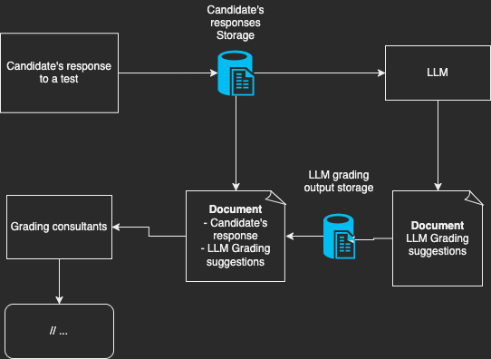

# Usage limits for candidate's test responses by LLM / AI 

## Context

LLM based apps can be vulnerable to attacks carried out by carefully crafting inputs or prompts.
These attacks, known as prompt hacking, can be used to trick LLMs based apps into generating unintended or malicious output. Source: https://owasp.org/www-project-llm-prompt-hacking

## Decision

This ADR is proposing to define and limit the usage scope of the candidate's test responses by an LLM.
A candidate's test responses can be used directly as LLM input if we can ensure the responses will not be used unscrutinized / unsanitized as an input for the LLM affecting future LLM responses.

The LLM's output after any candidate's test responses input, should not be available to the candidate but only to the grading consultant. 

## Consequences

Future model performance will become better, since we would have more control of the input data set.

