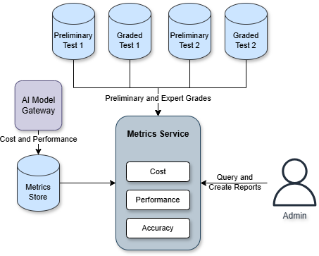

# Metrics Architecture

## Context

We need to track the AI grading system's performance (cost/efficiency and accuracy) to optimize it and demonstrate its value.

## Decision

- A Metrics Service will collect data from the AI Model Gateway and Preliminary Grader services.
- **Collected Metrics:**
    - **Cost/Performance (from Gateway):** Execution time, tokens used, model ID, timestamp.
    - **Accuracy (from Graders):** Candidate ID, Question/Submission ID, AI Grade, Expert Grade, Grade Difference Flag, optional reason.
- Data will be stored in a Metrics Store (ideally, leveraging the existing metrics store if suitable)
- A dashboard solution will visualize metrics and generate reports for:
    - AI grading cost.
    - Grading time (AI vs. Expert).
    - AI accuracy rate.
    - Accuracy trends.
    - Problem areas.

## Consequences

Visibility into performance, data-driven optimization, early issue detection, cost savings quantification, capacity planning support.
