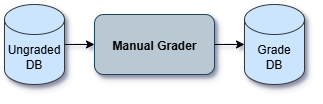
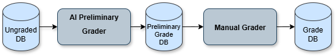
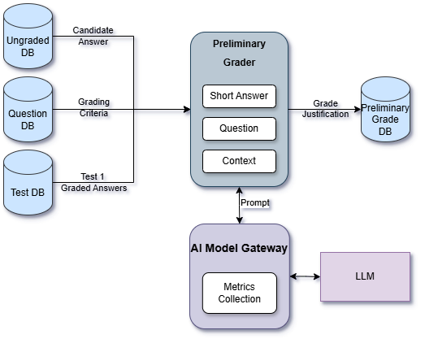
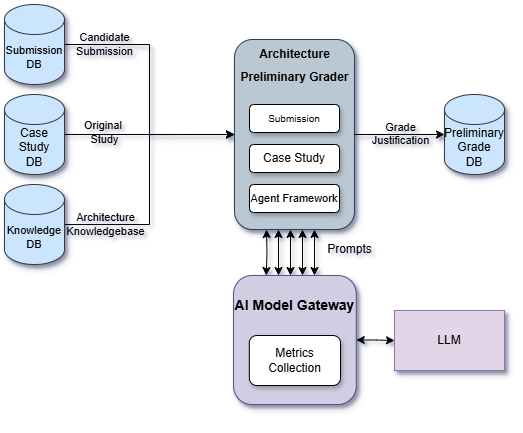
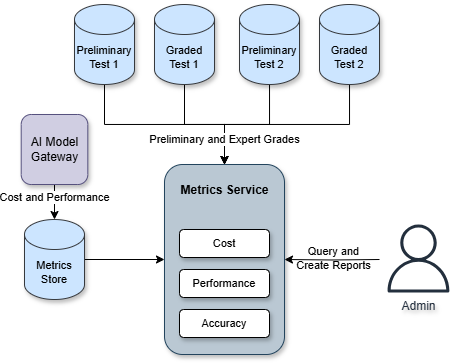

# Iterative Strategies

The Iterative Strategies Architects group is a team formed for participating in Architectural Katas - Winter 2025

## Team Members

- [Matthew Meade](https://www.linkedin.com/in/matthewmeade/)
- [Agustin Gomes](https://www.linkedin.com/in/agustingomes)
- [Vasileios Chroniadis](https://www.linkedin.com/in/chronvas/)
- [Bryte Henry](https://www.linkedin.com/in/bryte-h/)
- [Tyrone Jones](https://www.linkedin.com/in/tyronefjones/)

---

# Introduction and Goals

## **Mission**

Our mission is to help **Certifiable, Inc** scale sustainably its processes and operations to meet its increasing demand by presenting an architectural proposal that intends to optimize the different parts of the workflows by leveraging AI technologies and strategies with the ultimate goal of decreasing the required time for the certification process to be completed.

## **Challenges**

Considering the rapid evolution of AI technologies and ecosystem, combined with the nature of the LLM responses being non-deterministic, The sanitization of the information exchanged with the models remains one of the most challenging aspects of implementing AI technologies due to the natural language characteristics these systems possess, which poses the risk of returning irrelevant information for our context.

## Requirements Overview
The job to be done of adding AI to the existing architecture is to assist the expert graders by reducing the time it takes to grade an exam.

Grading Aptitude Tests
- The expert graders receive the question to be graded with a suggested score and justification

Grading Architecture Solutions
- The expert graders receive a suggested grade and AI summary of the solution to assist in grading

Accurate AI Responses
- The AI should have access to the context it needs to grade answers accurately
- The expert grader can override the AI response with a new grade if the AI is not accurate
- When this happens it should be logged so the system can be tuned and optimized for correctness

## Quality Goals
The top quality goals for the architecture

1. Costs of running the new AI system
2. Scalability, the system handle the 5-10x growth in global users along with the 21% yearly growth
3. Maintaining the accuracy and integrity of the exams

# Architecture Constraints
- The new Architecture must fit into the existing implementation
- Maintaining a low cost is a high priority

# Solution Strategy

## AI Preliminary Grade Flow

The overall strategy for adding AI to the existing architecture is to add an AI based preliminary grader system to the workflow for both the aptitude short answer questions and the architecture submissions. 

The new preliminary graders will read from the ungraded response databases and populate a new preliminary grade DB, which will be used by the expert graders.

Before: The manual grading stage read from the ungraded answers DB

After: The ungraded responses are processed by the AI grader which populates the preliminary grade DB for the manual grader to read from

### Test 1 - Short Answers

The Preliminary Grader service will prompt the AI model through the gateway to generate a grade and justification.

The service will use Retrieval Augmented Generation (RAG) to provide additional context to the prompt
- The original question along with any relevant grading criteria and information
- Graded answers from other candidates, with justifications

Since the questions are known ahead of time, the data being retrieved can be indexed by question ID. This reduces the complexity 
of finding relevant context

### Test 2 - Architecture Solutions

Since grading the candidate's architecture solution is significantly more complex than the short answers, the Architecture Preliminary Grader service will include an Agent. 

The service will be given the original case study, grading criteria, and the candidate's submission. 

This includes the addition of a "Knowledge Base" database as a source domain specific information that can be used as context when grading the exam. 

The AI agent will:
- Determine what context it needs and retrieve it from the Knowledge Base
- Prompt the model to perform grading
- Determine if the grading criteria have been covered
- If additional context is required, get that from the Knowledge Base and prompt the model again
- Otherwise, send the grade and justification to the preliminary database for the human expert to grade

#### Knowledge Base

This database will include a store of document managed by the company including all the relevant material required to grade the exam. Expert graders rely on advanced industry knowledge when grading
submissions, this solution provides the same level of context to the AI grader.

The database will consist of a document store containing all the documentation, indexed by key terms. 

When the AI decides it requires more context on a subject based on the solution or grading criteria it finds the relevant information by providing a set of key terms.

## Metrics and Observability
A metrics service will be responsible for observing the system's performance.

### Cost and Performance metrics

The AI Model Gateway will generate metrics related to running all prompts, including information such as execution time and tokens used. 
This data is saved into a metrics store, ideally the existing architecture's store that is already being used to collect other infrastructure metrics.

### AI Accuracy metrics
To validate the AI grading system is working well, the service will compare the preliminary AI grades to the expert grades. If the two are significantly different 
often it will raise red flags that the prompts, model, or frameworks need to be updated. 

## Deployment

### AI Model Management
The organization will manage deployment of the infrastructure running the AI model and assisting services in the existing cloud environment running the current architecture.

The benefits of this include:
- Data privacy: Proprietary company data and candidate information is not passed to a third party
- Flexibility: Managing the model in-house prevents vendor lock in and doesn't limit design decisions what is available by model providers
- Cost: The company pays for infrastructure but doesn't have to worry about API credits and usage limits

### Scalability
Multiple instances of the AI grading services, gateway, and model can be deployed to process grading in parallel. This will scale on-demand with the number of submissions waiting to be graded.

### Global Infrastructure
Since the software is being made available to candidates across the globe, the infrastructure should be expanded globally to ensure
the test taking experience is smooth for all users.

This may involve deploying copies of candidate facing services in many regions and deploying caches to store required data nearby.

# Implementation Details

## Cost Efficiency
For the new architecture to be viable, it should save more in expert hours than it costs to run. To validate this the organization will compare the 
amount of time it takes to grade exams before and after the new AI architecture. 

Currently it takes an expert `11` hours total to grade a single candidate's submissions for test 1 and 2. At `$50`/hour the cost to grade an exam is `$550` (assuming the candidate
passes test 1 and submits test 2). 

At `200` candidates per week the total cost for expert grading is `$110,000`/week. This becomes `$250,000` or `$500,000` per week after a 5x or 10x increase in candidates respectively.

At the 10x scale, every `1 hour` reduction in grading time saves `$100,000`/week in expert costs. 

## Prompt Frameworks
To ensure efficient and effective communication with the AI models, we will leverage established prompt engineering techniques and frameworks. These frameworks provide structure and best practices for crafting prompts that elicit the desired responses from LLMs, while also managing context and minimizing potential issues.

## Maintaining Test Integrity
Expert graders will have full control over the final grade and justification text, they will accept the AI result if appropriate and override it if there are any inaccuracies. 

This protects the system from hallucinations and malicious candidates trying to cheat through prompt injection. Any malicious submissions will be excluded from being used in any prompt contexts.

## Validating AI models
During the initial implementation the organization can leverage the existing data to create tests to evaluate potential AI models and frameworks.

- Set up a test environment that reads from past candidate submissions
- Compare the output to the expert's grade
- Tweak the model, prompts, etc until the output is sufficiently close to the expert grade

In production the same metrics are used to ensure the AI stays aligned with the exports. See [AI Accuracy metrics](#ai-accuracy-metrics)

Note: The submissions for test 2 may include images such as charts and diagrams, so the model should be multi-modal to support interpreting graphics. 

### Keeping the AI up to date

#### Updating the model
As model capabilities improve over time, the architecture supports swapping models seamlessly. Upgrading over time ensures the best performance possible. 

#### Architecture Knowledge
Since the system uses RAG and agent patterns, it can retrieve relevant context as needed without needing to make the information into the model itself. 

When architecture standards change, updating the relevant questions and documentation will ensure the model is working with the most up to date data possible.

# Architecture Decisions
- [What part of the Architecture would benefit from AI](./ADRs/ADR008/ADR008.md)
- [Managed AI Model vs Self Managed](./ADRs/ADR006/ADR006.md)
- [Model requirements for Architecture Submission grading](./ADRs/ADR007/ADR007.md)
- [Test 1 Architecture](./ADRs/ADR003/ADR003.md)
- [Architecture Submission Architecture](./ADRs/ADR004/ADR004.md)
- [Providing context to the model using RAG](./ADRs/ADR002/ADR002.md)
- [Safely using candidate submissions in context for other candidates](./ADRs/ADR001/ADR001.md)
- [Metrics Architecture](./ADRs/ADR005/ADR005.md)